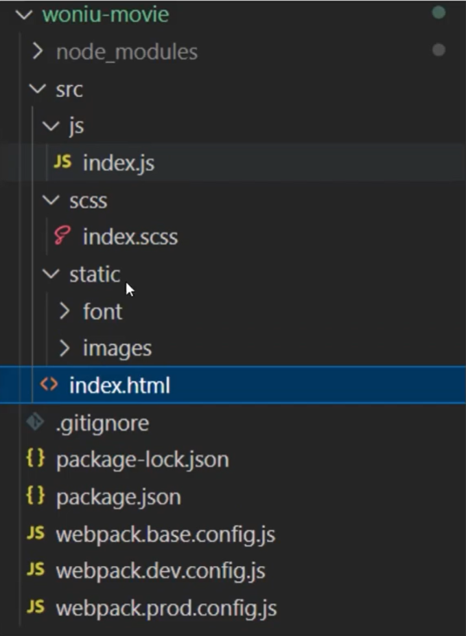

# webpack


## 一、准备工具

### 1、Node.js

在终端中任意路径输入 `node -v` 可以获取到版本号表示安装成功

```js
node -v
```

### 2、npm

当我们在电脑中安装好了Node之后，同时会自动安装一个npm工具

在终端中任意路径输入 `npm -v` 可以获取到版本号表示安装成功

```js
npm -v
```

NPM的全称是node package manager，是一个NodeJS包管理和分发工具，已经成功非官方发布Node模块（包）的标准。

## 二、项目初始化

创建一个文件夹，或者gitee创建一个项目管理

在**项目根目录**中打开终端执行以下代码

```js
npm init -y
```

该命令执行完成之后，会在项目根目录生成一个 `package.json` 文件。该文件中记录项目的相关信息，例如：项目名称、项目版本等。

### 1、下载webpack

在**项目根目录**中打开终端下载webpack的依赖包

```js
npm i webpack webpack-cli -D
```

- i: install 简写
- -D: 开发环境依赖
- -g: 全局模式
- -S： 生产环境

下载成功后， 在 `package.json` 文件中可以查看到相应的版本记录

### 2、生产环境和开发环境

在一个项目中从开发到上线过程中，我们会将程序分为两个环境：生产环境和开发环境

- 开发环境（development）：指的是我们项目开发过程中需要做的一些配置，主要方便开发人员调试；
- 生产环境（production）：指的是项目经过测试后，没有明显的异常，准备发布上线相关的配置，主要优化用户体验。

因此，针对不同的环境需要配置不同的配置文件，一般我们将相同的配置提取出来，形成公共的配置文件：

```
webpack.base.config.js //公共配置文件
webpack.prod.config.js //生产环境配置文件
webpack.dev.config.js //开发环境配置文件
```

### 3、合并公共配置

我们将开发环境和生产环境共同的配置提取出去了，但是最终运行的时候，还是需要将公共配置分别合并到开发环境和生产环境，所以我们需要一个插件帮助

- 下载插件

```
npm i webpack-merge -D
```

- 添加配置

在 `webpack.base.config.js` 中添加一下代码

```js
module.exports = {
    
}
```

- 合并公共配置

在 `webpack.prod.config.js` 和 `webpack.dev.config.js` 中添加代码

```js
// require node.js 后台引入方式
// 引入合并插件
const {merge} = require('webpack-merge')
// 公共配置
const base = require('./webpack.base.config')

// 合并公共配置
module.exports = merge(base, {
    mode: 'production'

})
```

### 4、配置环境模式

 在 `webpack.dev.config.js` 中添加代码

```js
// 合并公共配置
module.exports = merge(base, {
    mode: 'development'	// 表明开发环境
})
```

在 `webpack.prod.config.js` 中添加代码

```js
// 合并公共配置
module.exports = merge(base, {
    mode: 'production'	// 表明生产环境
})
```

### 5、配置项目启动命令

我们需要通过webpack去启动项目，启动过程中webpack会自动根据配置对代码进行编译处理，最后编译的代码在浏览器中打开。

- 配置生产环境启动

因为webpack的启动命令很长，因此我们通常会在 `package.js` 文件中将启动命令进行配置

```js
"scripts": {
    "test": "echo \"Error: no test specified\" && exit 1",
     "build": "webpack --config webpack.prod.config.js --mode production"
}
```

- 配置开发环境启动

在开发环境中，我们需要一边写代码一边编译才能查看，因此我们需要下载开发服务器插件

1、下载插件

```js
npm i webpack-dev-server -D
```


2、配置服务器

在 `webpack.dev.config.js` 中添加代码

```js
module.exports = merge(base, {
    mode: 'development',
    devServer: {
        port: '8080',   // 端口号
        // open: 'index.html'  // 启动后默认打开的页面
    }
})
```

3、配置启动命令

在 `package.json` 中添加代码

```js
"scripts": {
    "test": "echo \"Error: no test specified\" && exit 1",
     "build": "webpack --config webpack.prod.config.js --mode production",
      "dev": "webpack-dev-server --hot --config webpack.dev.config.js --mode development"
},
```

`npm run dev` 启动开发服务器

## 三、项目结构

### 1、src目录



### 2、基础配置

所有的基础配置都是开发和生产环境中需要用到的，所以我们在公共配置文件中进行下列配置

- 入口配置

因为每一个html文件都需要一个入口的js文件，所以我们需要在webpack中将这些入口js文件的名字和路径全都进行配置

在 `webpack.base.config.js` 中添加代码

```js
// 入口配置
entry: {
    index: './src/js/index.js'
}
```

- output出口配置

webpack在对我们的项目代码进行编译后，会得到一个新的代码，这个代码就是我们的出口文件。我们需要告诉webpack新代码储存的名称和位置。

在 `webpack.base.config.js` 中添加代码

```js
// 出口配置
output: {
    path: path.resolve(__dirname, 'dist'),
    filename: 'js/[name].js'
}
```

- 配置HTML

webpack默认只能处理js文件，所以如果需要处理HTML，则需要下载新的插件

1、下载插件

```js
npm i html-webpack-plugin -D
```

2、配置插件

在 `webpack.base.config.js` 中添加代码

```js
// 引入HTML解析插件
const HtmlWebpackPlugin = require('html-webpack-plugin')

...

    // 配置插件
    plugins: [
        new HtmlWebpackPlugin({
            template: './src/index.html',    // 设置需要解析文件的路径
            filename: 'index.html',  //编译后的文件名称
            chunks: ['index']   // 配置当前HTML中需要引入的JS文件名， 一般用一个入口文件即可
        })
    ]
```

- 优化HTML和JS配置

因为可能存在**多个**入口、出口，一一添加比较麻烦，因此我们使用列表循环来进行操作；

1、创建页面数组

首先在 `webpack.base.config.js` 中创建一个数组，用来存放项目中所有页面的名称

```js
// 设置一个数组拿来存放我们有的页面

const pages = ['index', 'login', 'register']
```

2、修改入口配置

```js
// 入口配置
entry: {
    // index: './src/js/index.js'
    ...pages.reduce(function(value, item) {
        return {
            ...value,
            [item]: `./src/js/${item}.js`
        }
    }, {})
},
```

3、修改HTML配置

在 `webpack.base.config.js` 中添加代码

```js
// 配置插件
plugins: [
    // new HtmlWebpackPlugin({
    //     template: './src/index.html',    // 设置需要解析文件的路径
    //     filename: 'index.html',  //编译后的文件名称
    //     chunks: ['index']   // 配置当前HTML中需要引入的JS文件名， 一般用一个入口文件即可
    // })
    ...pages.map(item =>{
        return new HtmlWebpackPlugin({
            template: `./src/${item}.html`,
            filename: `${item}.html`,
            chunks: [item]
        })
    })
]
```

- 配置babel

将文件中使用ES6及以上语法编译为ES5版本的，使低版本的浏览器可以使用

1、下载插件

```js
npm i babel-loader @babel/core @babel/preset-env -D
```


2、配置插件

在 `webpack.base.config.js` 中添加代码

```js
   module: {
        rules: [
            {
                test: /\.js$/i/,
                use: {
                    loader: 'babel-loader',
                    options: {
                        presets: ['@babel/preset-env']
                    }
                }
            }
        ]
    }
```

- 配置SCSS

1、js中引入scss

首先我们需要使用webpack处理scss文件，那么我们所有的scss文件都应该在页面对应的js文件中引入

在 `index.js` 中添加代码

```js
import '../scss/index.scss'
```

2、下载插件

```js
npm i node-sass sass-loader css-loader mini-css-extract-plugin -D
```

3、配置插件

在 `webpack.base.config.js` 中添加代码

```js
// 配置SCSS插件
const MiniCssExtractPlugin = require('mini-css-extract-plugin');

module.exports = {
...
    // 配置插件
    plugins: [
...
        new MiniCssExtractPlugin({
            filename: 'css/[name].css'
        })
    ],

    module: {
        rules: [
...
            {
                test: /\.scss$/i,
                exclude: /node_modules/,    // 排除node_modules 中的文件
                use: [
                    MiniCssExtractPlugin.loader,
                    'css-loader',
                    'scss-loader'
                ]
            }
        ]
    }
}
```

- 静态文件复制

在项目中，有一些文件我们不需要webpack处理，直接复制到编译后的目录即可。

1、下载插件

```js
npm i copy-webpack-plugin -D
```

2、配置插件

在 `webpack.base.config.js` 中添加代码

```js
// 拷贝不需要webpack处理的文件
const CopyPlugin = require('copy-webpack-plugin');

module.exports = {
    // 配置插件
    plugins: [
...
        new CopyPlugin({
            patterns: [
                {from: './src/static', to: './static'}
            ]
        })
    ]
}
```

- 全局配置JQuery

1、下载插件

```js
npm i jquery
```

2、配置插件

```js
// 引入webpack 用于加载全局事件
const Webpack = require('webpack');

module.exports = {
...
    // 配置插件
    plugins: [
        new Webpack.ProvidePlugin({
            '$': 'jquery'
        })
    ]
}
```

- source map（开发模式）

由于浏览器运行的都是webpack编译后的代码，所以报错显示的位置就不正确，因此添加配置方便我们找到错误位置

在 `webpack.dev.config.js` 中配置

```js
// 合并公共配置
module.exports = merge(base, {
...
    devtool: 'inline-source-map'
})
```

- 清除无用文件（生产模式）

1、下载插件

```js
npm i clean-webpack-plugin -D
```

2、配置插件

在 `webpack.prod.config.js` 中配置

```js
// 引入清除无用文件插件
const { CleanPlugin } = require('webpack')

// 合并公共配置
module.exports = merge(base, {
    mode: 'production',
    plugins: [
        new CleanPlugin()
    ]

})
```

