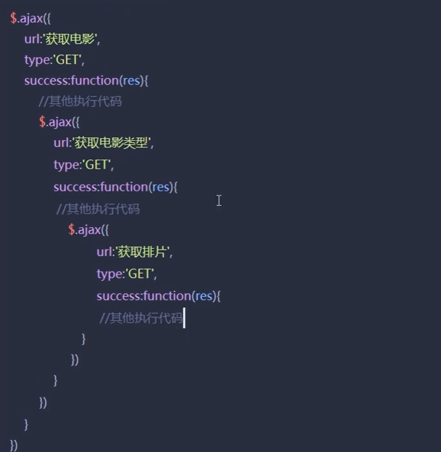
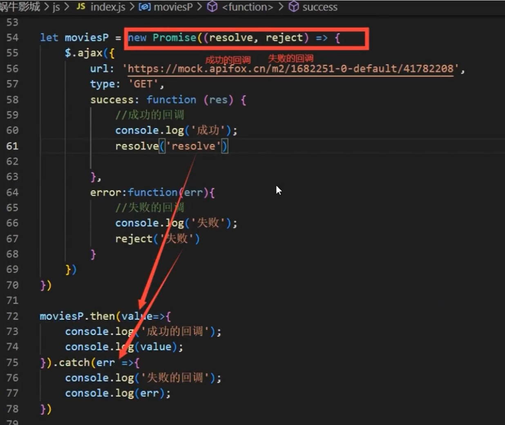
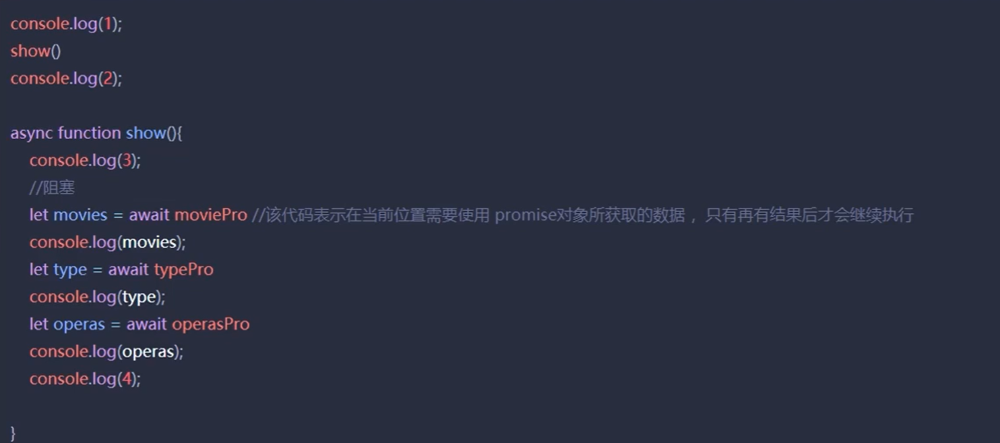

# 异步编程

- 常见的异步编程
  - 定时器
  - ajax、async属性为true时的请求

## 一、任务队列与事件循环

- 当同步和异步代码共存时，代码执行顺序由**任务队列**与**事件循环**机制决定

- 流程
  - 将要执行的js代码存储到代码执行栈中（代码容器中）
  - 依次执行栈中同步代码
  - 如果遇到异步代码，会将异步代码放到任务队列中，继续执行后面的同步代码。
  - 当执行栈中同步执行代码完成后，再取出任务队列中的第一个异步代码进行执行，执行完毕后继续取出下一个异步代码执行。
- 这种反复从任务队列中取出任务代码到执行栈中的操作，被称为 `事件循环`

## 二、回调地狱

- 异步代码数据由一类关系时，（后一个异步代码需要使用前一个异步代码的数据时），可以使用异步代码嵌套的方式进行解决，该嵌套现象被称为 **回调地狱**
- 回调地狱存在的问题
  - 代码可读性低
  - 代码维护难



## 三、Promise

- 背景：
  - 解决回调地狱问题
  - Ajax请求虽然默认是异步的，Promise是同步的


语法：

```js
new Promis((resolve, reject) => {
    // 成功的回调
    resolve('resolve')
    
    // 失败的回调
    reject('reject')
})
```



 

## 四、Promise 状态

每一个promise对象都内置了一个状态属性，用于存放promise对象对应异步代码的执行状态

- pending（等待）：默认值，每次创建新的promise对象时，该对象中的状态值为`prnding`
- resolve（成功）：当我们调用resolve方法时，改变promise对象中的状态值为`fulfilled`
- reject（失败）：当我们调用reject方法时，改变promise对象中的状态值为`rejected`

## 五、promise.all 与 promise.race

- promise.all()
  - 当所有的promise对象都为成功状态时，promise.all 才是成功

```js
promise.all([movieP, typeP, operasP]).then(value=>{
    // 当所有promise对象都为成功状态时调用
}).catch(err=>{
    // 当其中有一个promise对象为失败时调用
})
```

- promise.race()

  - 当其中一个promise状态改变时，promise.race()就跟着改变状态。


```js
promise.race([movieP, typeP, operasP]).then(value=>{
    // 当其中第一个改变状态的promise对象为成功状态时调用
}).catch(err=>{
    // 当其中第一个改变状态的promise对象为失败状态时调用
})
```


## 六、async 与 await

- 概念
  - ES7新增`async`和`await`关键字，用于简化回调地狱的解决方法

- async
  - 表示异步，可以用于修饰函数，表示函数为异步函数（函数内部代码执行时被阻塞不会影响函数外部代码继续执行）
  - 只能在异步函数内部才可以使用await
- await
  - 可以实现代码阻塞，等待目标promise对象对应异步代码执行有结果后，再继续执行await后面的代码



