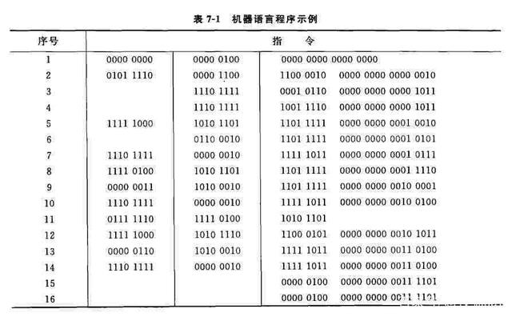
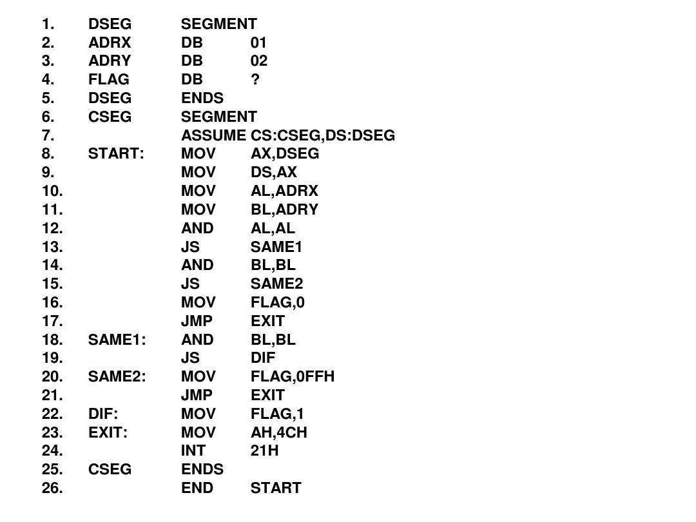

# js的发展

## 编程语言

概念：人与计算机沟通的语言，包括了：机器语言、汇编语言、高级语言

#### 机器语言：以二进制的编码对计算机硬件发出指令，是最原始，也是最高效的语言

#### 汇编语言：以英文的单词缩写对二进制代码进行了一层封装，也不太容易阅读，实现一个简单的功能都需要大量的逻辑代码，开发麻烦。也能直接对计算机发出指令，效率也不错。

#### 高级语言：以人类的语言作为基础，对汇编又再次封装，更容易被人理解。高级语言的执行效率低于汇编及机器语言。

常见的高级语言：C、C++、C#、java、php、python、go、javaScript...

## JavaScript概念

- javascript(简称js),是一种轻量级的解释性语言，也叫脚本语言。js是作为web网页开发而出名的，js是可以运行在浏览器环境中，现在也可以运行在其他环境：nodejs（后端环境）、adobe环境...

## JavaScript发展

1. 1995年js 诞生了，由网景公司的内部员工（布兰登-艾奇）花了10天时间就设计出了第一版js,当时叫做LiveScript、后期网景公司为了寻求发展，与SUN公司（java的研发公司）合作，改名JavaScript。
2. 1996微软为了抢市场，也开发出了一个脚本语言Jscript。
3. 网景公司后期把js交给了一个计算机协会：欧洲计算机制造协会（ECMA）—— ECMAScript。
4. 欧洲计算机制造协会ECMA为了前端脚本语言的统一组织：网景和微软的研发人员来开会，形成了一个第一版统一的js标准：ECMA-262
5. 1999年  ECMA推出了第三版js、包含了绝大部分的编程核心语法——ECMAScript 3  ，简称ES3
6. 2009年才推出了ECMAScript 5，简称ES5，也是目前市场上使用度最高的版本，2012年到现在位置所有浏览器都支持这个版本
7. 2015年  ECMAScript 2015，简称 ES6，更新了许多新的特性，IE全系不支持。
8. 2015年之后，每一年都会发布一个版本，2016——ES7 ... 2022年——ES13。ES14（草案中）

## js的核心组成

一个完整的js的语法是由三部分组成：ECMA核心语法、BOM、DOM

1. ECMA核心语法：主要包含了输入、输出、变量、数据类型、控制结构、数组、函数等...

2. 浏览器专属：
   1. BOM：负责与浏览器窗口进行交互的，比如：新建窗口、关闭页面、页面跳转、刷新、定时器等...
   2. DOM：负责与页面里的标签、样式进行交互，比如：新建标签，修改样式等...