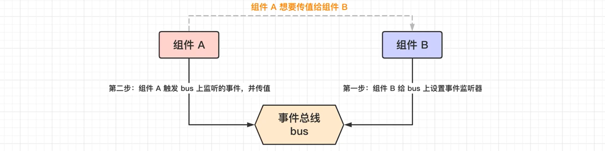

# 组件通信

组件通信：组件之间的传值

组件之间的关系除了父子关系外，还会有非父子组件，例如：兄弟。因此我们考虑组件之间的通信时，应考虑以下几种：

1、父组件给子组件传值：props

2、子组件给父组件传值：自定义事件

3、非父子组件之间传值：事件总线、Vuex（状态机）

## 一、事件总线

事件总线的缺陷在于：添加事件和触发事件，这两个步骤，需要严格遵循先后顺序，必须先添加事件，然后才能触发事件，

但是，在实际的应用时，很多时候是从组件A切换到组件B的时，才给组件B传值。

这样就会导致，传值的时候，组件B还没有开始创建，因此事件总线身上也没有添加任何事件，组件A无法触发事件来达到传值的效果。