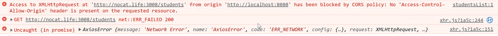

# 跨域

由于浏览器“同源策略”的限制，在浏览器中默认是不允许跨域访问的，一旦跨域访问，浏览器中就会抛出报错



## 一、概念

### 1、域的概念

域：可以理解为域名，通俗的来讲即为：网址；域由三部分组成：

1、协议

2、IP地址

3、端口号

例如： `http://10.211.55.3:8080/home` 域中， `http` 是协议， `10.211.55.3` 是IP地址， `8080`是端口号。

### 2、跨域的概念

当两个域之间，协议、IP、端口三者中有任意一个不一致，则为“不同源”的域。

例如： `http://10.211.55.3:8080` 和 `http://nocat.life:3008` 两个域之间，端口号明显不一样，因此这就是两个“不同源”的域，因此浏览器是不允许在这两个域之间进行互相的访问。

## 二、跨域的解决方案

网络请求跨域的解决方案，常用的有以下几种：

1、JSONP：只能解决GET请求的跨域

2、CORS：纯后端处理

3、proxy （代理服务器）：项目开发过程中最常用的方式

4、Nginx反向代理：项目上线后最常用的方式

### proxy

在Vue项目的根目录中，都会有一个 `vue.config.js` 文件，我们在该文件中添加以下配置代码，来解决跨域问题：

**配置完成，需要重启**

```javascript
// 当前文件中任何配置发生改变，项目都需要重新启动
module.exports = defineConfig({
	// ...
	// 开发服务器配置
	devServer: {
		proxy: {
			// 匹配项目中所有路径以 /api 开头的请求
			'/api': {
				target: 'http://nocat.life:3008', // 目标服务器地址
				changeOrigin: true,   // 解决跨域
				// 将所有请求中的 /api 替换成空字符串
				pathRewrite: {
					'^/api': ''
				}
			}
		}
	}
})

```

以上配置表示，会匹配到项目中所有以 `/api`开头的请求URL，然后将这些请求路径的 `/api` 换成空字符串，然后转发到target目标服务器。

附件说明：如果采用以上配置，项目中所有网络请求，都要以 `/api` 开头

```java
export default {
    methods: {
        // 获取学生数据
        async getStudents() {
            // 通过 axios 发送请求
            const ret = await axios({
                // url: 'http://nocat.life:3008/students',     // 原本的请求地址
                url: '/api/students',     // 处理了跨域后的请求地址
                method: 'GET'       // 请求类型
            })
            console.log(res);
            // if (ret.data.code) {
            //    this.tableData = ret.data.data.rows
            // }
        }
    }
}
```

