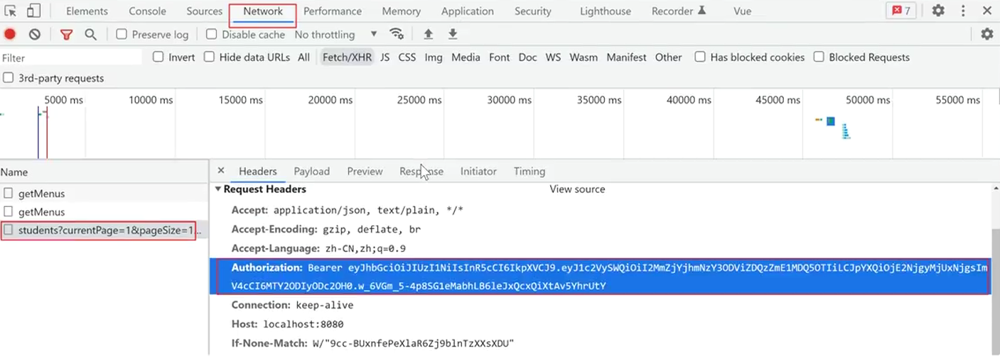

# 用户身份认证

用户身份认证，主要分为两个部分：

1、判断用户的登录状态

2、判断登录用户的角色权限

## 一、判断用户的登录状态

当用户访问项目中的一些权限页面时，首先需要先判断当前用户是否登录，如果没有登录，我们会直接提示用户去登录，并强制跳转到登录页面。

### 1、用户登录

当用户登录成功后，后端会返回一个包含用户信息的token给前端，前端需要将token保存在本地存储中：

```js
export default {
  data() {
    return {
      form: {
        username: 'admin',
        password: '123',
      }
    }
  },
  methods: {
    async login() {
      const res = await this.$api.users.login(this.form)
      if (res.code) {
        // 将后端返回的token保存到本地存储中
        localStorage.token = res.token
        this.$message({
          message: "恭喜你，登录成功",
          type: "success"
        })
        this.$router.replace("home")
      } else {
        this.$message.error("账号或密码错误，请重试")
      }
    }
  }
}
```

### 2、验证用户的登录状态

在项目中，有部分页面是需要登录的，但是也有部分页面是不需要登录的，例如：注册页、登录页、以及404页面，因此，我们需要判断当前用户访问的到底是那一部分的页面，然后再来决定是否需要判断权限。

- 全局守卫方式

给项目中添加一个全局前置守卫：

```js
const router = new VueRouter({
    ...
})

// 全局前置守卫
router.beforeEach((to, from, next) => {
    if(to.path.includes('/home')) {
        // 进入if，则表示用户访问的页面需要权限
        
    } else {
        // 进入else，则表示用户访问的页面不需要权限
        next()
    }	
})
```

下一步，当判断出用户访问的页面需要权限，开始对用户的登录状态进行判断：

```js
router.beforeEach((to, from, next) => {
    if (to.path.includes('/home')) {
        // 获取本地存储的 token
        const token = localStorage.user_token
        if (token) {
            next()
        } else {
            MessageBox.alert('你还未登录，请先登录。', '警告', {
                confirmButtonText: '确定',
                callback: action => {
                    next('/login')
                }
            })
        }
    } else {
        // 进入else，则表示用户访问的页面不需要权限
        next()
    }
})
```

- 局部守卫方式（可选）

通过分析，学生管理系统中，所有需要权限的页面，都是home的子页面，所以，我们可以直接给home路由配置一个“路由独享守卫”

```js

// 用来配置项目中所有需要切换的页面（组件和路径）
const routes = [
    {
        path: '/home',
        component: HomeView,
        // 路由独享守卫：前置守卫，在用户进入home之前执行
        beforeEnter: (to, from, next) => {
            // 获取本地存储的 token
            const token = localStorage.user_token
            // 判断是否有 token
            if (token) {
                next()	// 如果有 token，直接放用户通过
            } else {
                MessageBox.alert('你还未登录，请先登录。', '警告', {
                    confirmButtonText: '确定',
                    callback: action => {
                        next('/login')	// 强制跳转到登录页面
                    }
                })
            }
        }
]
```

## 二、判断用户角色权限

大部分时候，在一个项目中，登录的用户会分成多种角色，例如有超级管理员和普通管理员，以及更多的角色，不同的角色在项目中拥有不同的权限，能访问的路由和功能，都会存在一定的区别。

### 1、给请求头添加 token

不同权限的用户，登录成功后，能够访问的菜单是不一样的。因此，在用户登录成功后，我们需要向后端发送请求，来获取当前用户能访问的菜单数据。

但是，后端需要拿到前端存储的token，才能根据token来判断用户的角色。因此，我们**前端需要将 token 添加到请求头中**，然后随着请求一起发送给后端。

- 配置

我们找到项目中的 `src/utils/requests.js` 文件，在该文件中，给axios配置请求拦截器，在请求拦截器中，统一给项目中所有请求的header 中添加token：

```js
// 请求拦截器：当前端将请求发送给后端之前，会被请求拦截器拦截下来
axios.interceptors.request.use((config) => {
    // 将 token 添加到请求头中， 其中 Authorization 是后端定义的
    config.headers.Authorization =  localStorage.user_token;
    return config;
})
```

其中： `Authorization` 是由后端决定的，通常在接口文档中会有相应的说明

### 2、发送请求获取菜单数据

我们在全局的前置守卫中，当判断用户登录成功后，我们就可以开始发送请求向后端获取菜单数据：

```js

router.beforeEach(async (to, from, next) => {
    if (to.path.includes('/home')) {
        // 获取本地存储的 token
        const token = localStorage.user_token
        if (token) {
            // 获取菜单数据
            const res = await api.users.getMenus()
            if (res.code) {
                // store.commit('SET_MENUS', res.data)
                console.log(res.data);
            }
            next()
        } else {
			// ...
        }
    } else {
        // 进入else，则表示用户访问的页面不需要权限
        next()
    }
})
```

### 3、保存菜单数据到状态机

用户相关的数据，通常我们会保存在主仓库中：

```js
export default new Vuex.Store({
    state: {
        menus: []	// 菜单数据初始值
    },
    mutations: {
        SET_MENUS(state, payload) {
            state.menus = payload
        }
    },
    // ...
})
```

然后在请求成功后，调用mutations方法，将菜单数据传递到主仓库中：

```js
import store from '@/store';

router.beforeEach(async (to, from, next) => {
    if (to.path.includes('/home')) {
        // 获取本地存储的 token
        const token = localStorage.user_token
        if (token) {
            // 获取菜单数据
            const res = await api.users.getMenus()
            if (res.code) {
                store.commit('SET_MENUS', res.data)
            }
            next()
        } else {
			// ...
        }
    } else {
        // 进入else，则表示用户访问的页面不需要权限
        next()
    }
})
```

### 4、菜单组件渲染数据

在菜单组件中，通过辅助函数，获取到主仓库中的菜单数据，并渲染；

```js
import { mapState, mapActions } from 'vuex'

export default {
    computed: {
        ...mapState(['menus'])
    }
}
```

## 三、身份认证过期处理

通常，后端在生成token时，会设置一个token的有效期，因此，当token过期后，即使前端仍然保有token字段，页面也无法访问； 



### 处理401的报错

在 `src/utils/request.js` 文件中，在axios 的响应拦截器中处理401的报错

```js
axios.interceptors.response.use((ret) => {
    // 将 return 的数据返回给前端组件
    return ret.data;
}, (err) => {
    if (err.response?.status == 401) {
        MessageBox.alert('你还未登录，请先登录。', '警告', {
            confirmButtonText: '确定',
            callback: action => {
                router.replace('/login')
            }
        })
    }
    return Promise.reject(err.message);
});
```

